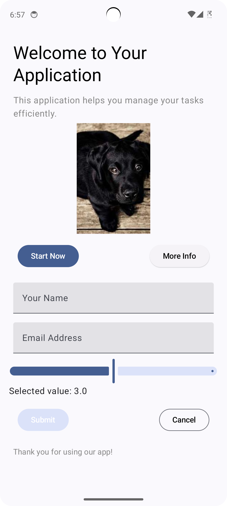

# UIShift SDK Configuration Guide

UIShift is an SDK designed to dynamically generate user interfaces using Jetpack Compose based on a configuration file. This document provides a detailed guide on how to create a `ScreenConfiguration` JSON document, including all available components, styles, actions, and example configurations.

## Overview

UIShift allows developers to build flexible and dynamic user interfaces by defining UI components and their behaviors in a configuration file. By using Jetpack Compose, the SDK makes it easy to create rich, interactive UIs that adapt to changing data and user interactions.

## Components Overview

The following UI components are available for use in your configuration document:

### 1. TextComponent

- **Properties**:
  - `content`: String (The text to display)
  - `style`: String (The style token to apply)
  - `id`: String (Unique identifier)

### 2. ButtonComponent

- **Properties**:
  - `label`: String (The label displayed on the button)
  - `style`: String (The style token for button appearance)
  - `onClickAction`: Action (The action to perform when clicked)
  - `id`: String (Unique identifier)

### 3. ImageComponent

- **Properties**:
  - `url`: String (The URL of the image)
  - `description`: String (Description of the image)
  - `id`: String (Unique identifier)

### 4. ColumnComponent

- **Properties**:
  - `children`: List<UIComponent> (List of child components)
  - `isScrollable`: Boolean (Default value `false`)
  - `id`: String (Unique identifier)

### 5. RowComponent

- **Properties**:
  - `children`: List<UIComponent> (List of child components)
  - `isScrollable`: Boolean (Default value `false`)
  - `id`: String (Unique identifier)

### 6. TextFieldComponent

- **Properties**:
  - `label`: String (The label for the text field)
  - `hint`: String (The hint text shown inside the text field)
  - `initialValue`: String (The default value, defaults to empty)
  - `id`: String (Unique identifier)

### 7. CheckBoxComponent

- **Properties**:
  - `label`: String (The label for the checkbox)
  - `isChecked`: Boolean (Whether the checkbox is checked, defaults to false)
  - `id`: String (Unique identifier)

### 8. SliderComponent

- **Properties**:
  - `min`: Float (Minimum value of the slider)
  - `max`: Float (Maximum value of the slider)
  - `initialValue`: Float (Initial value of the slider)
  - `id`: String (Unique identifier)

### 9. Unknown Component

- **Properties**:
  - `id`: String (Unique identifier)

## Actions Overview

The following actions can be performed in response to UI events:

### 1. Navigate

- **Properties**:
  - `destination`: String (The destination to navigate to)

### 2. SubmitData

- **Properties**:
  - `formData`: Map<String, String> (Key-value pairs of form data)

### 3. ValidateField

- **Properties**:
  - `fieldId`: String (The ID of the field to validate)

### 4. NoAction

- Represents no action to be taken.

## Styles Overview

### Button Styles

- **primaryButton**: Default primary button style.
- **secondaryButton**: Secondary button style.
- **tertiaryButton**: Tertiary button style.
- **outlinedButton**: Outlined button style.
- **destructiveButton**: Red button style for destructive actions.

### Text Styles

- **mainTitle**: Style for the main title.
- **sectionTitle**: Style for section titles.
- **subSectionTitle**: Style for sub-section titles.
- **primaryHeader**: Style for primary headers.
- **secondaryHeader**: Style for secondary headers.
- **tertiaryHeader**: Style for tertiary headers.
- **primaryTitle**: Style for primary titles.
- **secondaryTitle**: Style for secondary titles.
- **tertiaryTitle**: Style for tertiary titles.
- **mainContent**: Style for main content text.
- **secondaryContent**: Style for secondary content text.
- **smallContent**: Style for smaller content text.
- **primaryLabel**: Style for primary labels.
- **secondaryLabel**: Style for secondary labels.
- **smallLabel**: Style for small labels.

## Creating a ScreenConfiguration JSON

Here's how youcan create a valid JSON document for a `ScreenConfiguration`.

### Example JSON Configuration

```json
{
  "components": [
    {
      "type": "Column",
      "id": "mainColumn",
      "isScrollable": true,
      "children": [
        {
          "type": "Text",
          "id": "welcomeText",
          "content": "Welcome to Your Application",
          "style": "primaryHeader"
        },
        {
          "type": "Text",
          "id": "appDescription",
          "content": "This application helps you manage your tasks efficiently.",
          "style": "mainContent"
        },
        {
          "type": "Image",
          "id": "appImage",
          "height": 200,
          "scaleType": "crop",
          "url": "https://picsum.photos/id/237/200/300",
          "description": "App screenshot"
        },
        {
          "type": "Row",
          "id": "buttonRow",
          "children": [
            {
              "type": "Button",
              "id": "startButton",
              "label": "Start Now",
              "style": "primaryButton",
              "onClickAction": {
                "type": "Navigate",
                "destination": "task_list"
              }
            },
            {
              "type": "Button",
              "id": "infoButton",
              "label": "More Info",
              "style": "secondaryButton",
              "onClickAction": {
                "type": "Navigate",
                "destination": "info_page"
              }
            }
          ]
        },
        {
          "type": "TextField",
          "id": "userNameField",
          "label": "Your Name",
          "hint": "Enter your name",
          "initialValue": ""
        },
        {
          "type": "TextField",
          "id": "emailField",
          "label": "Email Address",
          "hint": "Enter your email",
          "initialValue": ""
        },
        {
          "type": "Checkbox",
          "id": "termsCheckBox",
          "label": "I accept the terms and conditions",
          "isChecked": false
        },
        {
          "type": "Slider",
          "id": "prioritySlider",
          "min": 1,
          "max": 5,
          "initialValue": 3
        },
        {
          "type": "Row",
          "id": "actionRow",
          "children": [
            {
              "type": "Button",
              "id": "submitButton",
              "label": "Submit",
              "style": "tertiaryButton",
              "onClickAction": {
                "type": "SubmitData",
                "formData": {
                  "name": "userNameField",
                  "email": "emailField",
                  "termsAccepted": "termsCheckBox"
                }
              }
            },
            {
              "type": "Button",
              "id": "cancelButton",
              "label": "Cancel",
              "style": "outlinedButton",
              "onClickAction": {
                "type": "NoAction"
              }
            }
          ]
        },
        {
          "type": "Text",
          "id": "footerText",
          "content": "Thank you for using our app!",
          "style": "secondaryContent"
        },
        {
          "type": "RadioButton",
          "id": "red",
          "label": "Red",
          "isSelected": false
        },
        {
          "type": "Switch",
          "id": "botSetting",
          "label": "Enable bot",
          "isChecked": true
        },
        {
          "type": "Divider",
          "id": "startDivider",
          "direction": "horizontal",
          "thickness": 1
        },
        {
          "type": "Spacer",
          "id": "space",
          "height": 32
        },
        {
          "type": "Divider",
          "id": "endDivider",
          "direction": "horizontal",
          "thickness": 1
        }
      ]
    }
  ]
}
````
### Result of above JSON Configuration

