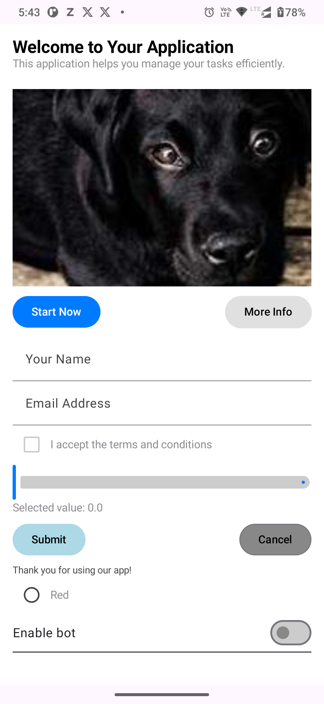

# UIShift SDK Configuration Guide

UIShift is an SDK designed to dynamically generate user interfaces using Jetpack Compose based on a configuration file. This document provides a detailed guide on how to create a `ScreenConfiguration` JSON document, including all available components, styles, actions, and example configurations.

## Table of Contents
- [Overview](#overview)
- [Components Overview](#components-overview)
- [ActionsFlow Overview](#actionsflow-overview)
- [Objects Overview](#objects-overview)
- [Validation Overview](#validation-overview)
- [Styles Overview](#styles-overview)
- [Creating a ScreenConfiguration JSON](#creating-a-screenconfiguration-jSON)
  
## Overview

UIShift allows developers to build flexible and dynamic user interfaces by defining UI components and their behaviors in a configuration file. By using Jetpack Compose, the SDK makes it easy to create rich, interactive UIs that adapt to changing data and user interactions.

## Components Overview

### Common Component's Properties

All components share these common properties:

- `id`: String (Required unique identifier)
- `padding`: Object
  - `top`: Number (default: 0)
  - `bottom`: Number (default: 0)
  - `start`: Number (default: 0)
  - `end`: Number (default: 0)
- `background`: Object
  - `color`: String (Hex color code, default: "#FFFFFF")
  - `gradient`: Object (optional)
    - `startColor`: String (Hex color code)
    - `endColor`: String (Hex color code)
    - `orientation`: String ("vertical", "horizontal", "diagonal")
  - `image`: String (URL to background image, optional)
- `shape`: Object
  - `type`: String ("rectangle", "circle", "roundedRectangle", "oval")
  - `cornerRadius`: Number (default: 0)
  - `borderColor`: String (Hex color code, optional)
  - `borderWidth`: Number (default: 0)
- `visibility`: String ("visible", "gone")
- `alignment`: String ("start", "center", "end", "top", "bottom")
- `animation`: Object (optional)
  - `type`: String ("fadeIn", "fadeOut", "slideIn", "slideOut", "scale", "rotate")
  - `duration`: Number (milliseconds, default: 300)
  - `delay`: Number (milliseconds, default: 0)
- `interactions`: Object
  - `onClick`: Action object (optional)
  - `onLongPress`: Action object (optional)
  - `onSwipe`: Object (optional)
    - `direction`: String ("left", "right", "up", "down")
    - `action`: Action object
- `accessibility`: Object
  - `description`: String (optional)
  - `isFocusable`: Boolean (default: true)
  - `isClickable`: Boolean (default: false)
- `width`: Object - one of:
  - `{"type": "fillMaxSpace"}`
  - `{"type": "wrapContent"}`
  - `{"type": "fixed", "value": number}`
- `height`: Object - same options as width

The following UI components are available for use in your configuration document:


### 1. TextComponent

- **Properties**:
  - `type`: String (Has fixed value `Text`)
  - `content`: String (The text to display)
  - `style`: String (The style token to apply)
  - `visualTransformation`: String (How text should transform, value can be `none` or `password` or `capitalize`)

```json
{
  "type": "Text",
  "content": "Hello World",
  "style": "mainContent",
  "visualTransformation": "none"
}
```

### 2. ButtonComponent

- **Properties**:
  - `type`: String (Has fixed value `Button`)
  - `label`: String (The label displayed on the button)
  - `style`: String (The style token for button appearance)
  - `isEnabled`: Boolean (Whether enabled or disabled, defaults to `true`)
  - `onClickAction`: ActionFlow (The actions to perform when clicked)

```json
{
  "type": "Button",
  "label": "Click Me",
  "style": "primaryButton",
  "isEnabled": true,
  "onClickAction": {
    
  }
}
```

### 3. ImageComponent

- **Properties**:
  - `type`: String (Has fixed value `Image`)
  - `url`: String (The URL of the image)
  - `scaleType`: String (How image should scale, value can be `crop` or `fit` or `fillBounds`. defaults to `fit` )
  - `description`: String (Description of the image)

```json
{
  "type": "Image",
  "url": "https://example.com/image.jpg",
  "description": "Sample image",
  "scaleType": "fit"
}
```

### 4. ColumnComponent

- **Properties**:
  - `type`: String (Has fixed value `Column`)
  - `children`: List<UIComponent> (List of child components)
  - `isScrollable`: Boolean (Default value `false`)
  - `childArrangement`: ChildArrangement

```json
{
  "type": "Column",
  "children": [],
  "isScrollable": false,
  "childArrangement": {
    "direction": "vertical",
    "spacing": 8,
    "alignment": "start",
    "isWrap": false
  }
}
```
### 5. RowComponent

- **Properties**:
  - `type`: String (Has fixed value `Row`)
  - `children`: List<UIComponent> (List of child components)
  - `isScrollable`: Boolean (Default value `false`)
  - `childArrangement`: ChildArrangement (How children will arranged)

```json
{
  "type": "Row",
  "children": [],
  "isScrollable": false,
  "childArrangement": {
   
  }
}
```
### 6. TextFieldComponent

- **Properties**:
  - `type`: String (Has fixed value `TextField`)
  - `label`: String (The label for the text field)
  - `hint`: String (The hint text shown inside the text field)
  - `isEnabled`: Boolean (Whether enabled or disabled, defaults to `true`)
  - `readOnly`: Boolean (Whether editable, defaults to `true`)
  - `initialValue`: String (The default value, defaults to empty)
  - `validation`: Validation (Takes validation object)
  - `imeAction`: ImeAction (IMEAction, value can be `done`, `go` `search`, `send` and `next` defaults to `done`),
  - `keyboardType`: KeyboardType (Which keyboard should appear, defaults to `text`) ),

```json
{
  "type": "TextField",
  "label": "Username",
  "hint": "Enter username",
  "initialValue": "",
  "isEnabled": true,
  "readOnly": false,
  "validation": {
    "type": "text",
    "required": true,
    "minLength": 3,
    "maxLength": 50,
    "regex": "^[A-Za-z0-9]+$",
    "errorMessage": "Invalid username"
  },
  "imeAction": "done", 
  "keyboardType": "text"
}
```

### 7. CheckBoxComponent

- **Properties**:
  - `type`: String (Has fixed value `Checkbox`)
  - `label`: String (The label for the checkbox)
  - `isEnabled`: Boolean (Whether enabled or disabled, defaults to `true`)
  - `isChecked`: Boolean (Whether the checkbox is checked, defaults to false)
  - `validation`: Validation (Takes validation object)

```json
{
  "type": "Checkbox",
  "label": "Accept terms",
  "isChecked": false,
  "isEnabled": true,
  "validation": {
    "type": "binary",
    "required": true,
    "errorMessage": "Please accept terms"
  }
}
```

### 8. SliderComponent

- **Properties**:
  - `type`: String (Has fixed value `Slider`)
  - `min`: Float (Minimum value of the slider)
  - `max`: Float (Maximum value of the slider)
  - `isEnabled`: Boolean (Whether enabled or disabled, defaults to `true`)
  - `initialValue`: Float (Initial value of the slider)
  - `validation`: Validation (Takes validation object)

```json
{
  "type": "Slider",
  "min": 0,
  "max": 100,
  "initialValue": 50,
  "isEnabled": true,
  "validation": {
    "type": "numeric",
    "required": true,
    "minValue": 0,
    "maxValue": 100,
    "errorMessage": "Invalid value"
  }
}
```

### 9. RadioButton

- **Properties**:
  - `type`: String (Has fixed value `RadioButton`)
  - `label`: String (The label for the radio button)
  - `isEnabled`: Boolean (Whether enabled or disabled, defaults to `true`)
  - `isSelected`: Boolean (Whether the radio button is selected, defaults to false)
  - `validation`: Validation (Takes validation object)

```json
{
  "type": "RadioButton",
  "label": "Option 1",
  "isSelected": false,
  "isEnabled": true,
  "validation": {
    "type": "selection",
    "required": true,
    "errorMessage": "Please select an option"
  }
}
```

### 10. Switch

- **Properties**:
  - `type`: String (Has fixed value `Switch`)
  - `label`: String (The label for the switch)
  - `isEnabled`: Boolean (Whether enabled or disabled, defaults to `true`)
  - `isChecked`: Boolean (Whether the switch is checked, defaults to false)
  - `validation`: Validation (Takes validation object)

```json
{
  "type": "Switch",
  "label": "Enable feature",
  "isChecked": false,
  "isEnabled": true,
  "validation": {
    "type": "binary",
    "required": true,
    "errorMessage": "Please make a selection"
  }
}
```

### 11. Divider

- **Properties**:
  - `type`: String (Has fixed value `Divider`)
  - `direction`: String (direction for the divider, value can be `horizontal` or `vertical`, defaults to `horizontal`)
  - `thickness`: Int (Thickness of divider, defaults to 1)
  - `color`: String (Color of divider, can be any hexadecimal color code, default to `#000000`)

```json
{
  "type": "Divider",
  "thickness": 1,
  "direction": "horizontal",
  "color": "#000000"
}
```

### 12. Spacer

- **Properties**:
  - `type`: String (Has fixed value `Spacer`)

```json
{
  "type": "Spacer"
}
```

## ActionsFlow Overview

### 1. Single

- **Properties**:
  - `action`: Action (Action to perform)
  
### 2. Sequence

- **Properties**:
  - `sequence`: ActionSequence (ActionSequence to perform)

The following actions can be performed in response to UI events:
### Action

### 1. Navigate

- **Properties**:
  - `destination`: String (The destination to navigate to)
  - `params`: Map<String, String> (Key-value pairs of params)

```json
{
  "type": "Navigate",
  "destination": "screen_name",
  "params": {
    "key": "value"
  }
}
```

### 2. ApiRequest

- **Properties**:
  - `requestModel`: Request (Contains request data)
  - `retryCount`: Number
  - `onRetry`: Action (Optional)
  - `onSuccess`: Action (Action to perform if success fails. Optional)
  - `onFailure`: Action (Action to perform if validation fails. Optional)

```json
{
  "type": "ApiRequest",
  "requestModel": {
    "type": "command",
    "endpoint": "/api/endpoint",
    "action": "create",
    "parameters": {
      "key": "value"
    },
    "headers": {
      "Authorization": "Bearer token"
    },
    "retries": 3,
    "timeout": 3000
  },
  "onSuccess": {
  },
  "onFailure": {
  }
}
```

### 3. Validate

- **Properties**:
  - `field`: Field (The ID of the field to validate)
  - `validation`: Validation
  - `onValidationFail`: Action (Action to perform if validation fails. Optional)

```json
{
  "type": "Validate",
  "field": {
    "id": "fieldId",
    "type": "text",
    "metadata": {
      "key": "value"
    }
  },
  "validation": {
    
  },
  "onValidationFail": {
  }
}
```

### 4. ShowError

- **Properties**:
  - `message`: String
  - `prefixes` [Action] (Defaults to empty)
  - `postfixes`: [Action] (Defaults to empty)
  - `logError`: Boolean (defaults to `true`)

```json
{
  "type": "ShowError",
  "message": "Error message",
  "prefixes": [], 
  "postfixes": [],
  "logError": true
}
```

### 5. ShowSuccessMessage

- **Properties**:
  - `message`: String
  - `prefixes` [Action] (Defaults to empty)
  - `postfixes`: [Action] (Defaults to empty)
  - `logSuccess`: Boolean (defaults to `true`)

```json
{
  "type": "ShowSuccessMessage",
  "message": "Success message",
  "prefixes": [],
  "postfixes": [],
  "logSuccess": true
}
```

## Objects Overview

### Field

- **Properties**:
  - `id`: String
  - `type`: String (Component type value)
  - `metaData`: Map<String, Any>? (Optional)
  
### ActionSequence

- **Properties**:
  - `core`: Action
  - `prefixes`: [Action] (Defaults to empty)
  - `postfixes`: [Action] (Defaults to empty)
  - `onError`: Action (Optional)

## Request Overview
- **Properties**:
  - `endpoint`: String
  
### 1. Command

- **Properties**:
  - `action`: String
  - `parameters`: Map<String, Any>? (Optional)
  - `headers`: Map<String, String>? (Optional)
  - `retries`: Number (Defaults to 3)
  - `timeout`: Number (Defaults to 3000 in milliseconds)
  
### 2. Query

- **Properties**:
  - `query`: String
  - `filters`: Map<String, Any>? (Optional)
  - `headers`: Map<String, String>? (Optional)
  - `retries`: Number (Defaults to 3)
  - `timeout`: Number (Defaults to 3000 in milliseconds)

### 3. CustomRequest

- **Properties**:
  - `customType`: String
  - `payload`: Map<String, Any>
  - `retries`: Number (Defaults to 3)
  - `timeout`: Number (Defaults to 3000 in milliseconds)


## Validation Overview

### 1. Text

- **Properties**:
  - `required`: Boolean
  - `minLength`: Number (Optional)
  - `maxLength`: Number (Optional)
  - `regex`:  String (Optional)
  - `errorMessage`: String (Optional)

### 2. Binary

- **Properties**:
  - `required`: Boolean
  - `errorMessage`: String (Optional)

### 3. Numeric

- **Properties**:
  - `required`: Boolean
  - `minValue`: Number (Optional)
  - `maxValue`: Number (Optional)
  - `errorMessage`: String (Optional)`
### 4. Selection

- **Properties**:
  - `required`: Boolean
  - `errorMessage`: String (Optional)

### 5. None

- **Properties**:
  - `none`: String (Defaults to `None`)


## Styles Overview

### Theme 

- Theme is configurable, can be configured as below.

```kotlin
        
        val colorScheme = UiShiftColorScheme(primaryButtonBackground = Color.LightGray)
        val typography = UiShiftTypography(
            mainTitle = TextStyle(
                fontFamily = FontFamily.Default,
                fontWeight = FontWeight.Bold,
                fontSize = 30.sp,
                letterSpacing = 0.sp
            )
        )
        UiShift.initialize(
            colorScheme = colorScheme,
            typography = typography
        )
```
- Note: Available pre-defined color schemes are lightColorScheme() or darkColorScheme, defaults to lightColorScheme, but developer define their own color schemes as well.

### Button Styles

- **primaryButton**: Default primary button style.
- **secondaryButton**: Secondary button style.
- **tertiaryButton**: Tertiary button style.
- **outlinedButton**: Outlined button style.
- **destructiveButton**: Red button style for destructive actions.

### Text Styles

- **mainTitle**: Style for the main title.
- **sectionTitle**: Style for section titles.
- **subSectionTitle**: Style for sub-section titles.
- **primaryHeader**: Style for primary headers.
- **secondaryHeader**: Style for secondary headers.
- **tertiaryHeader**: Style for tertiary headers.
- **primaryTitle**: Style for primary titles.
- **secondaryTitle**: Style for secondary titles.
- **tertiaryTitle**: Style for tertiary titles.
- **mainContent**: Style for main content text.
- **secondaryContent**: Style for secondary content text.
- **smallContent**: Style for smaller content text.
- **primaryLabel**: Style for primary labels.
- **secondaryLabel**: Style for secondary labels.
- **smallLabel**: Style for small labels.

## Creating a ScreenConfiguration JSON

Here's how youcan create a valid JSON document for a `ScreenConfiguration`.

### Example Configuration JSON

```json
{
  "components": [
    {
      "type": "Column",
      "id": "mainColumn",
      "isScrollable": true,
      "children": [
        {
          "type": "Text",
          "id": "welcomeText",
          "content": "Welcome to Your Application",
          "style": "primaryHeader"
        },
        {
          "type": "Text",
          "id": "appDescription",
          "content": "This application helps you manage your tasks efficiently.",
          "style": "mainContent"
        },
        {
          "type": "Image",
          "id": "appImage",
          "height": 250,
          "scaleType": "crop",
          "url": "https://picsum.photos/id/237/200/300",
          "description": "App screenshot"
        },
        {
          "type": "Row",
          "id": "buttonRow",
          "width": "fillMaxSpace",
          "children": [
            {
              "type": "Button",
              "id": "infoButton",
              "label": "More Info",
              "style": "secondaryButton",
              "onClickAction": {
                "type": "Single",
                "action": {
                  "type": "Navigate",
                  "destination": "home"
                }
              }
            },
            {
              "type": "Button",
              "id": "startButton",
              "label": "Start Now",
              "style": "primaryButton",
              "onClickAction": {
                "type": "Single",
                "action": {
                  "type": "Navigate",
                  "destination": "home"
                }
              }
            }
          ]
        },
        {
          "type": "TextField",
          "id": "userNameField",
          "label": "Your Name",
          "hint": "Enter your name",
          "initialValue": "",
          "width": "fillMaxSpace"
        },
        {
          "type": "TextField",
          "id": "emailField",
          "label": "Email Address",
          "hint": "Enter your email",
          "initialValue": "",
          "width": "fillMaxSpace"
        },
        {
          "type": "Checkbox",
          "id": "termsCheckBox",
          "label": "I accept the terms and conditions",
          "isChecked": false
        },
        {
          "type": "Slider",
          "id": "prioritySlider",
          "min": 1,
          "max": 5,
          "initialValue": 3
        },
        {
          "type": "Row",
          "id": "actionRow",
          "width": "fillMaxSpace",
          "children": [
            {
              "type": "Button",
              "id": "submitButton",
              "label": "Submit",
              "style": "tertiaryButton",
              "onClickAction": {
                "type": "Single",
                "action": {
                  "type": "ApiRequest",
                  "requestModel": {
                    "type": "Command",
                    "action": "",
                    "parameters": {

                    },
                    "headers": {

                    },
                    "endpoint": "register",
                    "retries": 3,
                    "timeout": 3000
                  },
                  "retryCount": 0
                }
              }
            },
            {
              "type": "Button",
              "id": "cancelButton",
              "label": "Cancel",
              "style": "outlinedButton",
              "onClickAction": {
                "type": "Single",
                "action": {
                  "type": "Navigate",
                  "destination": "home"
                }
              }
            }
          ]
        },
        {
          "type": "Text",
          "id": "footerText",
          "content": "Thank you for using our app!",
          "style": "secondaryContent"
        },
        {
          "type": "RadioButton",
          "id": "red",
          "label": "Red",
          "isSelected": false
        },
        {
          "type": "Switch",
          "id": "botSetting",
          "label": "Enable bot",
          "isChecked": true
        },
        {
          "type": "Divider",
          "id": "startDivider",
          "direction": "horizontal",
          "thickness": 1
        },
        {
          "type": "Spacer",
          "id": "space",
          "height": 32
        },
        {
          "type": "Divider",
          "id": "endDivider",
          "direction": "horizontal",
          "thickness": 1
        }
      ]
    }
  ]
}
````
### Result of above JSON Configuration


### Usage
#### Step 1. Add the JitPack repository to your build file
Add it in your root build.gradle at the end of repositories
````
	dependencyResolutionManagement {
		repositoriesMode.set(RepositoriesMode.FAIL_ON_PROJECT_REPOS)
		repositories {
			mavenCentral()
			maven { url 'https://jitpack.io' }
		}
	}
````
#### Step 2. Add the dependency
Add the dependency module build.gradle

````
	dependencies {
	        implementation 'com.github.wittgroup-inc:uishift-sdk:Tag'
	}
````
[](https://jitpack.io/#wittgroup-inc/uishift-sdk)
##
